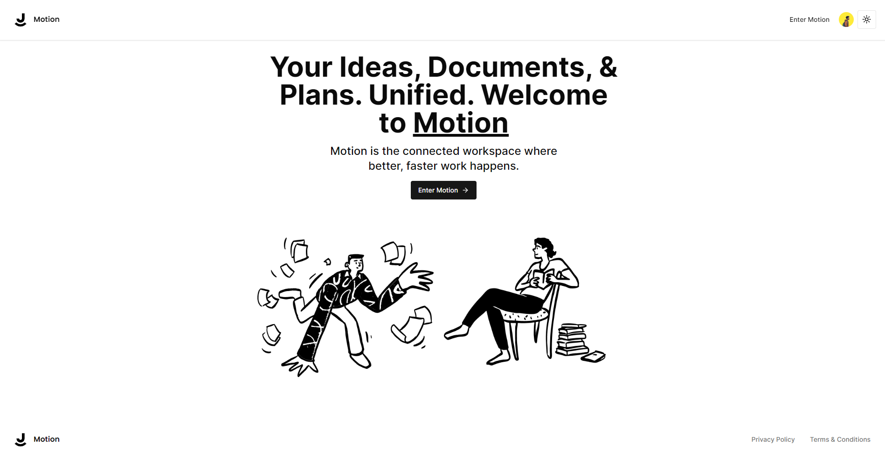

<h1 align="center">Motion - A Notion Clone: Next.js 13, React, Convex, Tailwind</h1>

<p align="center">Seamless collaboration on a Next.js 13 and React-powered
platform with a dynamic Notion-style editor for real-time
document collaboration. Elevate user experience with a thoughtfully designed interface
supporting Light and Dark modes, featuring an expandable
sidebar for easy navigation. Take control with infinite children documents, a soft-delete
trash can, and file management (upload, deletion, replacement)
with real-time icon updates for efficient organization.</p>

<h2>Live Demo</h2>

<p>Check out the live demo <a href="https://motion-notetakingapp.vercel.app/">here</a>.</p>

<h2>Screenshot</h2>
    

<h2 >Key Features</h2>

<ul>
        <li>Real-time database  🔗 </li>
        <li>Notion-style editor 📝 </li>
        <li>Light and Dark mode 🌓</li>
        <li>Infinite children documents 🌲</li>
        <li>Trash can & soft delete 🗑️</li>
        <li>Authentication 🔐 </li>
        <li>File upload</li>
        <li>File deletion</li>
        <li>File replacement</li>
        <li>Icons for each document (changes in real-time) 🌠</li>
        <li>Expandable sidebar ➡️🔀⬅️</li>
        <li>Full mobile responsiveness 📱</li>
        <li>Publish your note to the web 🌐</li>
        <li>Fully collapsable sidebar ↕️</li>
        <li>Landing page 🛬</li>
        <li>Cover image of each document 🖼️</li>
        <li>Recover deleted files 🔄📄</li>
    </ul>

<h2>Prerequisites</h2> 

<p>Node version 18.x.x</p>


 Install packages

```shell
npm i
```

### Setup .env file


```js
# Deployment used by `npx convex dev`
CONVEX_DEPLOYMENT=
NEXT_PUBLIC_CONVEX_URL=

NEXT_PUBLIC_CLERK_PUBLISHABLE_KEY=
CLERK_SECRET_KEY=

EDGE_STORE_ACCESS_KEY=
EDGE_STORE_SECRET_KEY=
```

### Setup Convex

```shell
npx convex dev

```

### Start the app

```shell
npm run dev
```

<h2>Contributing</h2>

<p>Contributions are welcome! Feel free to open an issue or submit a pull request.</p>
